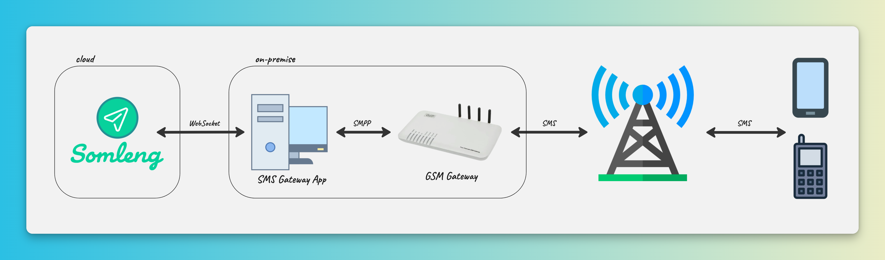
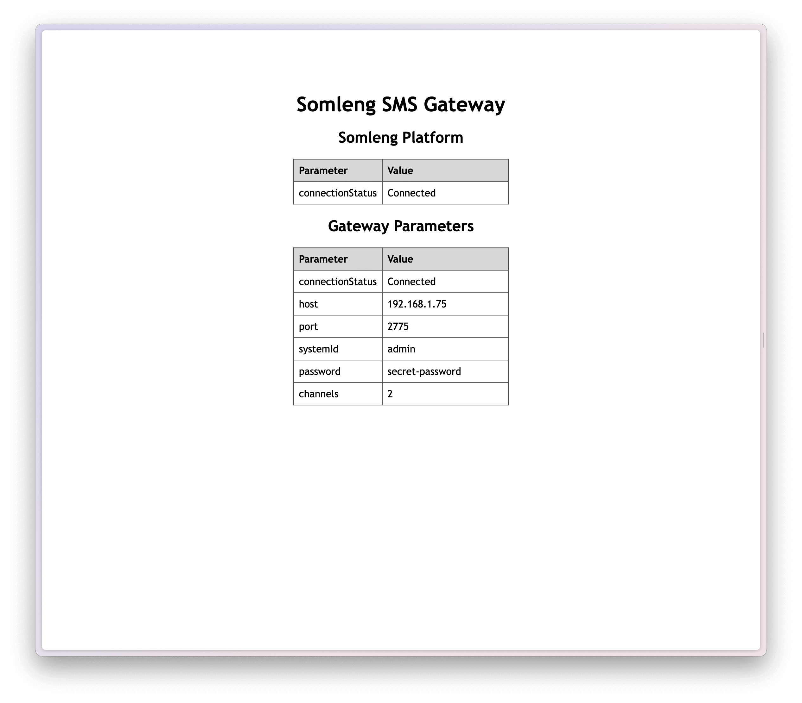
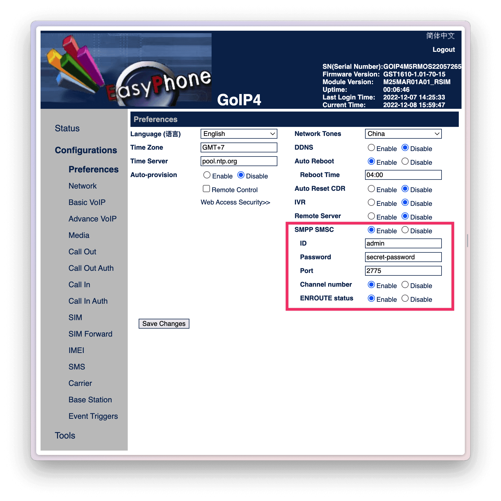
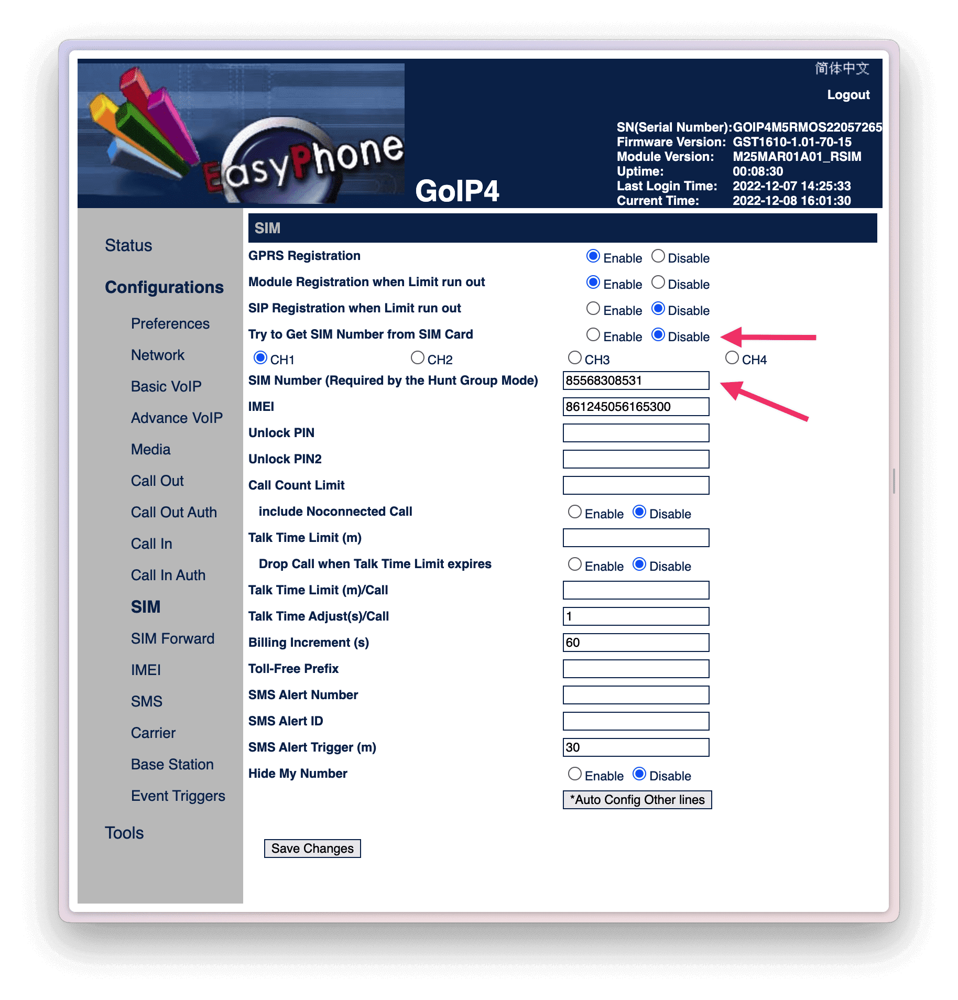

# Somleng SMS Gateway

[](https://github.com/somleng/sms-gateway/actions)

Somleng SMS Gateway (part of [The Somleng Project](https://github.com/somleng/somleng-project)) is used to set up your own on-premise SMS gateway system and connect it to Somleng.
This will give you the ability to take full control of your SMS infrastructure.



## Downloading and Installing the SMS Gateway

Download the [latest release](https://github.com/somleng/sms-gateway/releases) for your operating system.

## Usage

### Synopsis

```sh
Usage: somleng-sms-gateway [options] [command]

Options:
  -k, --key <value>               Device key
  -d, --domain <value>            Somleng Domain (default: "wss://app.somleng.org")
  -p, --http-server-port <value>  HTTP Server Port (default: "3210")
  -v, --verbose                   Output extra debugging
  -h, --help                      display help for command

Commands:
  goip [options]                  connect to GoIP Gateway
  smpp [options]                  connect to SMPP Gateway
  dummy                           connect to dummy Gateway
  help [command]                  display help for command
```

The application supports a number of connection modes including:

* [SMPP](#smpp)
* [GoIP (GSM Gateway)](#goip-gsm-gateway)
* [Dummy](#dummy)

### Web Interface

The Web interface displays connection information and configuration parameters. By default it's available
at [http://localhost:3210](http://localhost:3210).



### Connection Modes

The documentation for running the SMS Gateway for each connection mode can be found below.

#### SMPP

The SMPP connection mode is used to connect to a single SMPP server.

```sh
Usage: somleng-sms-gateway smpp [options]

connect to SMPP Gateway

Options:
  --smpp-host <value>       SMPP host
  --smpp-port <value>       SMPP port (default: "2775")
  --smpp-system-id <value>  SMPP System ID
  --smpp-password <value>   SMPP password
  -h, --help                display help for command
```

#### GoIP (GSM Gateway)

The GoIP connection mode is used to connect to a [GoIP GSM Gateway](https://en.wikipedia.org/wiki/GoIP)

##### GSM Gateway Configuration

Using the GoIP GSM Gateway web portal, configure the following:

Under **Configurations** -> **Preferences**:

1. Set SMPP SMSC to **Enable**
2. Fill in **ID** with an SMPP system ID
3. Fill in **Password** with an SMPP password
4. Fill in **Port** with an SMPP port
5. Set Channel number to **Enable**
6. Set ENROUTE status to **Enable**



Under **Configurations** -> **SIM**:

1. Set **Try to Get SIM Number from SIM Card** to **Disable**
2. For each channel on your gateway, enter the phone number for the SIM card in E.164 format.

*Note: We recommend that you manually configure the phone numbers for each SIM in your gateway to ensure
the format is in E.164. These numbers must exactly match the phone numbers that you configure on the [Somleng Dashboard](https://www.somleng.org/docs.html#sms_gateway_configuration_guide_create_phone_number).*



##### Start the SMS Gateway

Start the SMS Gateway in GoIP mode, ensuring that the configuration parameters match what you configured above.

```sh
Usage: somleng-sms-gateway goip [options]

connect to GoIP Gateway

Options:
  --goip-smpp-host <value>       SMPP host
  --goip-smpp-port <value>       SMPP port (default: "2775")
  --goip-smpp-system-id <value>  SMPP System ID
  --goip-smpp-password <value>   SMPP password
  --goip-channels <value>        Number of channels
  -h, --help                     display help for command
```

#### Dummy

The Dummy connection mode is used to test the connection between the SMS Gateway and Somleng.
Outbound messages are simply output to stdout.

```sh
Usage: somleng-sms-gateway dummy [options]

connect to dummy Gateway

Options:
  -h, --help  display help for command
```

## License

The software is available as open source under the terms of the [MIT License](http://opensource.org/licenses/MIT).
